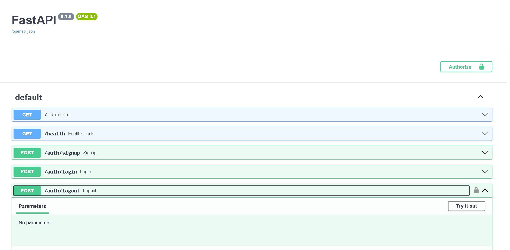

# Task API

A CRUD REST API for managing to-do tasks, built with FastAPI, backed by PostgreSQL, and secured with Supabase Auth — containerized end-to-end with Docker.

This project evolved across four assignments:
- **A1** — tasks stored in memory (a Python list, lost on restart)
- **A2** — tasks stored in a SQLite file
- **A3** — tasks stored in a real Postgres database, running in its own container, with the whole stack (app + database) started via a single `docker compose up` command
- **A4 (this stage)** — added user authentication via Supabase: signup, login, logout, and JWT-based route protection using FastAPI dependency injection

The service and route logic never changed shape across this swap — only one file, `db.py` (the repository), was replaced. That's the architecture proving itself: storage is just an implementation detail behind a stable interface.

## Running it

**Requirements:** Docker Desktop installed and running.

1. Clone this repo and move into the project folder:
   ```bash
   git clone https://github.com/DEVANSH1-svd/Internship.git
   cd Internship/todo-api
   ```

2. Copy the example environment file:
   ```bash
   cp .env.example .env
   ```
   (The default values work out of the box for local development — no changes needed unless you want a different password.)

3. Start the whole stack — API and database together, in one command:
   ```bash
   docker compose up --build
   ```

4. The API is now running at `http://localhost:8000`. Interactive docs are available at `http://localhost:8000/docs`.

On first startup, the `tasks` table is created automatically and seeded with 3 example tasks. Restarting the stack (`docker compose down` then `docker compose up`) will **not** duplicate the seed data or lose existing rows — the database lives in a Docker volume that persists independently of the containers.

## Environment variables

See `.env.example` for the required variables:

| Variable | Description |
|---|---|
| `DATABASE_URL` | Postgres connection string. When running via `docker compose`, the app container reaches the database container using the service name `db` (not `localhost`) — this is already configured correctly in `compose.yaml`. |
| `SUPABASE_URL` | Your Supabase project's base URL (e.g. `https://xxxx.supabase.co`) — **no path suffix** like `/rest/v1/`. Found in Supabase Dashboard → Project Settings → API. |
| `SUPABASE_KEY` | Your Supabase project's publishable (or legacy anon) API key — safe for client-side use, respects Row Level Security. **Never use the secret/service_role key here.** |

## Endpoints

| Method | Path | Description | Success | Error |
|---|---|---|---|---|
| GET | `/` | API info | `200` | — |
| GET | `/health` | Health check | `200` | — |
| GET | `/tasks` | List all tasks | `200` | — |
| GET | `/tasks/{id}` | Get a single task by id | `200` | `404` if not found |
| POST | `/tasks` | Create a new task | `201` | `400` if title is empty |
| PUT | `/tasks/{id}` | Update a task's title/done status | `200` | `400` empty title, `404` not found |
| DELETE | `/tasks/{id}` | Delete a task | `204` | `404` if not found |

## Example request

```
$ curl -i http://localhost:8000/tasks

HTTP/1.1 200 OK
content-type: application/json

[{"id":1,"title":"Learn FastAPI","done":false},{"id":2,"title":"Build a CRUD API","done":false},{"id":3,"title":"Buy milk","done":true}]
```

## Database screenshot

<!-- Add your own screenshot here — see instructions below -->


*To generate this: run `docker exec -it <db-container-name> psql -U postgres -d tasks -c "\dt"` and `-c "SELECT * FROM tasks;"`, screenshot the terminal output, and save it as `db-screenshot.png` in this folder.*

## Architecture notes

All database logic lives in `db.py` — the repository module. `main.py` (routes) has no knowledge of SQL, connection strings, or Postgres specifically; it only calls functions like `get_all_tasks()` or `create_task_db(title, done)`. This separation is what allowed the storage engine to change from an in-memory list, to SQLite, to Postgres, without ever touching a route handler or changing an endpoint's request/response shape.

All queries use parameterized placeholders (`%s`) rather than string interpolation, to prevent SQL injection.

## Persistence, proven

To confirm data survives a full stack teardown (not just an app restart):
1. Created a task via `POST /tasks`
2. Ran `docker compose down` (removes both containers entirely)
3. Ran `docker compose up` again
4. Confirmed via `GET /tasks` that the created task was still present

This works because the Postgres data directory is mounted to a named Docker volume (`taskdata`), which exists independently of the container's lifecycle.


## Auth endpoints

| Method | Path | Description | Auth required | Success | Error |
|---|---|---|---|---|---|
| POST | `/auth/signup` | Create a new user account | No | `201` | `400` missing fields or Supabase signup error |
| POST | `/auth/login` | Authenticate and receive a JWT | No | `200` + `access_token`/`refresh_token` | `400` missing fields, `401` invalid credentials |
| POST | `/auth/logout` | Revoke the current session | **Yes** (Bearer token) | `204` | `401` missing/invalid/expired token |
| GET | `/public/info` | Public, unauthenticated info | No | `200` | — |
| GET | `/protected/profile` | Get the authenticated user's profile | **Yes** (Bearer token) | `200` | `401` missing/invalid/expired token |
| GET | `/protected/dashboard` | Example second protected route | **Yes** (Bearer token) | `200` | `401` missing/invalid/expired token |

Protected routes require an `Authorization: Bearer <access_token>` header, obtained from `/auth/login`. Tokens are verified against Supabase on every request — invalid, tampered, or expired tokens are rejected.

## Auth architecture

Authentication is delegated entirely to Supabase (acting as the Identity Provider) rather than implemented from scratch — no password hashing, session storage, or token-signing logic lives in this codebase. The app's role is limited to:
1. Forwarding signup/login credentials to Supabase's Auth API
2. Verifying incoming Bearer tokens by asking Supabase to confirm their validity (`supabase.auth.get_user(token)`)

Token verification logic is centralized in a single reusable FastAPI dependency, `get_current_user()`, applied via `Depends()` to every protected route. This avoids duplicating auth-checking code across routes — adding a new protected endpoint only requires adding `user = Depends(get_current_user)` to its signature.

Swagger UI (`/docs`) is configured with FastAPI's `HTTPBearer` security scheme, enabling the "Authorize" button — paste a token once and test any protected route directly from the browser.

### Swagger UI — Bearer auth in action




## Future improvements

- Add a `/health` check that also pings the database (`SELECT 1`) and reports `db: "ok"`
- Add an index on the `done` column and benchmark with `EXPLAIN ANALYZE`
- Add Redis to the compose stack for caching (planned for a later assignment)
- Multi-stage Dockerfile to slim the final image size
- Move to a layered architecture (routes / services / repository as separate modules)
- Scope tasks to the authenticated user (add a `user_id` column, filter all task queries by the logged-in user)
- Local JWT signature verification (using Supabase's public key) instead of calling `get_user()` on every request, to reduce latency and avoid a network round-trip per protected request
- Refresh token flow — currently the client must re-login once the access token expires; a `/auth/refresh` endpoint would improve UX