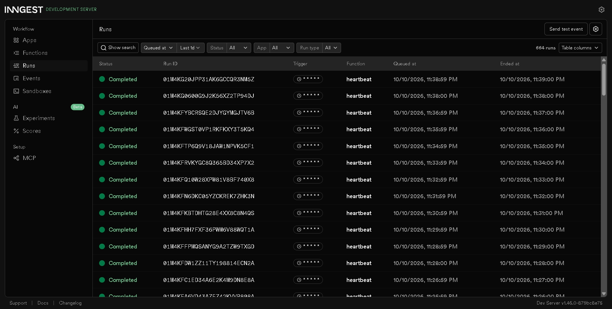

# Background Job API

A small FastAPI service whose slow work runs in a background job. `POST /reports` answers immediately with `202`, an [Inngest](https://www.inngest.com) function builds the report in the background, and `GET /reports/{id}` reports progress. A cron function runs every minute with no request at all.

The pattern is: **accept fast, work in the background, report status.**

## Run it

Needs Python 3.10+ and Node.js. Use two terminals.

```powershell
pip install -r requirements.txt
```

**Terminal 1: the API**

```powershell
$env:INNGEST_DEV = "1"; python -m uvicorn main:app --port 8000
```

**Terminal 2: the Inngest Dev Server (dashboard at http://localhost:8288)**

```powershell
npx inngest-cli@latest dev -u http://localhost:8000/api/inngest
```

## Endpoints and functions

| Kind | Name | Trigger | What it does |
|---|---|---|---|
| Endpoint | `GET /health` | request | Returns `{"status":"ok"}` |
| Endpoint | `POST /reports` | request | Body `{"topic":"cats"}`. Saves a pending report, sends `report/requested`, returns `202`. Missing topic returns `400` |
| Endpoint | `GET /reports/{id}` | request | Returns the report (`pending`, then `done` plus result). Unknown id returns `404` |
| Function | `say-hello` | event `test/hello` | Stage 1 test: sleeps 5 s, returns a greeting |
| Function | `make-report` | event `report/requested` | Sleeps 8 s (stand-in for slow work), then builds the result. `retries=2`, so 3 attempts in total |
| Function | `heartbeat` | cron `* * * * *` | Logs how many reports are pending, done and failed |

## Proof: 202, then the two polls

```
POST /reports  {"topic":"cats"}
HTTP/1.1 202 Accepted
{"id":"f924c681-2b38-41b0-b66d-30ced41639a0","status":"pending"}

GET /reports/f924c681-...  (a few seconds later)
{"id":"f924c681-2b38-41b0-b66d-30ced41639a0","topic":"cats","status":"pending"}

GET /reports/f924c681-...  (after the 8 s job)
{"id":"f924c681-2b38-41b0-b66d-30ced41639a0","topic":"cats","status":"done","result":"A very thorough report about cats."}
```

The POST answered in about 285 ms including curl start-up, while the work takes about 8 seconds.

## Stage 3: retries versus bad input

A missing topic is bad input that fails every time, however often it is retried, so the API rejects it with 400 and starts no job; a job that fails at a bad moment, like a network drop, is worth retrying because the next attempt can succeed.

## Stage 4: cron

- Every day at 08:00: `0 8 * * *` (minute 0, hour 8, every day of the month, every month, every day of the week), in UTC unless a timezone is set.
- Every Sunday at 22:00: `0 22 * * 0` (minute 0, hour 22, any day of the month, any month, and day-of-week 0, which is Sunday).

## Dashboard screenshots

Retries: topic `fail` is sent to a function configured with `retries=2` (3 attempts in total). The run history is visible in the dashboard at http://localhost:8288.


Heartbeat: two runs one minute apart.



## Known limits and future improvements

- Reports live in memory and are lost on restart. A database would fix that.
- Nothing sets a report to `failed`, so a job that exhausts its retries still reads `pending`, and the heartbeat always shows `failed=0`. A fix would be an `on_failure` handler that updates the report.
- No idempotency check: the same event delivered twice would build the report twice.
