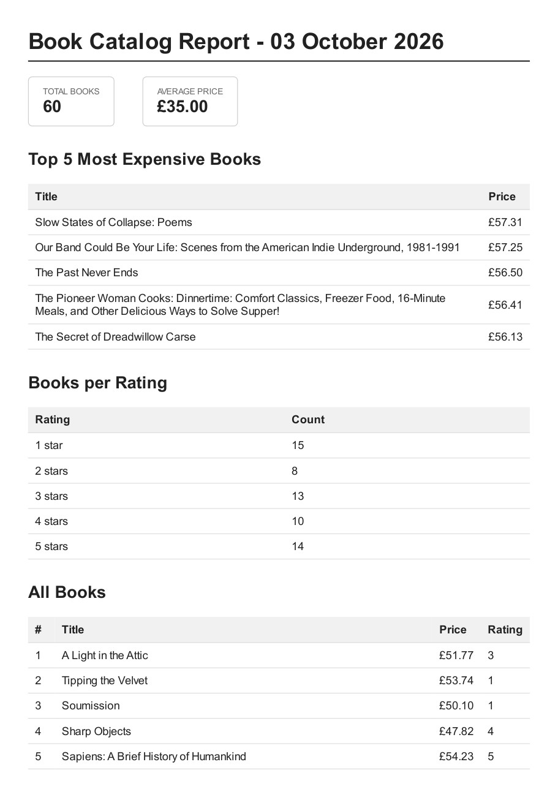

# PDF Report Generator

A small FastAPI service that turns data in a SQLite database into a PDF report. The client asks for a report with `POST /reports`, then downloads the finished file by link.

The pipeline: **query** (SQL aggregation) -> **render** (HTML template -> PDF with headless Chromium) -> **store** (file on disk, path in the database) -> **serve** (download by link).

## Dataset

The bookstore option: the 60 validated books collected by my A9 scraper from books.toscrape.com (`scraper/output/books.json` in this repo). `seed.py` loads them into `report.db`.

## Setup and run

This project lives in the `pdf-report-generator/` folder of a larger repo and reads `../scraper/output/books.json`, so clone the whole repo.

```powershell
cd pdf-report-generator
python -m venv venv
.\venv\Scripts\Activate.ps1
python -m pip install -r requirements.txt
playwright install chromium
python seed.py
python -m uvicorn main:app --port 8000
```

`seed.py` deletes existing rows first, so running it twice leaves exactly 60 books. Interactive API docs are at http://localhost:8000/docs.

## Endpoints

| Method | Path | Success | Errors |
|---|---|---|---|
| GET | `/health` | 200 `{"status": "ok"}` | |
| POST | `/reports` | 201 new report, or 200 if one already exists for today | 500 if rendering fails |
| GET | `/reports/{id}` | 200 report record | 404 unknown id |
| GET | `/reports/{id}/file` | 200 the PDF | 404 unknown id, 409 not finished |

`POST /reports` accepts an optional body `{"force": true}` to generate a fresh report even if one exists today. Responses contain a link (`/reports/<id>/file`), never the server's disk path or the file's bytes.

## Aggregation SQL

```sql
SELECT COUNT(*) AS count FROM books;

SELECT AVG(price) AS avg_price FROM books;

SELECT title, price
FROM books
ORDER BY price DESC
LIMIT 5;

SELECT rating, COUNT(*) AS count
FROM books
GROUP BY rating
ORDER BY rating;
```

## Proof: generate and download

First request creates the report (201). Note the pause while Chromium renders:

```
curl.exe -i -X POST http://localhost:8000/reports
HTTP/1.1 201 Created
{"id":2,"created_at":"2026-10-03T13:02:20.678099","report_date":"2026-10-03","status":"complete","file":"/reports/2/file"}
```

Download it:

```
curl.exe -o my-report.pdf http://localhost:8000/reports/2/file
```

The result is a real PDF (66,657 bytes in a fresh-clone run, starts with `%PDF-1.4`).

Unknown id:

```
curl.exe -i http://localhost:8000/reports/999
HTTP/1.1 404 Not Found
{"detail":"No report with id 999"}
```

## Proof: duplicate requests make one report

Two POSTs fired at the same moment (via `Start-Job`) when no report existed for today. Both carry the same id, one is 201 and one is 200, and `reports_output/` gained exactly one file (3 -> 4):

```
HTTP/1.1 201 Created
{"id":4,"created_at":"2026-10-03T13:09:55.633143","report_date":"2026-10-03","status":"complete","file":"/reports/4/file"}
HTTP/1.1 200 OK
{"id":4,"created_at":"2026-10-03T13:09:55.633143","report_date":"2026-10-03","status":"pending","file":"/reports/4/file"}
```

The second response is `pending` because it arrived while the first was still rendering. The duplicate check counts `pending` rows as well as `complete` ones. Counting only `complete` rows would let a second render start.

`{"force": true}` skips the check and returns a new id with 201.

## Page 1 of a generated report



## Why not do the work inside the request?

I would move report generation out of the request once it takes long enough that a user or client might time out or give up waiting, for example with thousands of rows or many people generating reports at once, because the request holds a connection open while Chromium renders; a background job would answer immediately and let the client check the status later.

## What the duplicate check protects against

The check protects against a double-click or a retry creating two reports and two PDF files for what the user meant as one request, and my concurrent test showed it must also count in-progress (pending) reports, otherwise a second request arriving during the few seconds of rendering would start a duplicate render. A real example is a payment or order button: without an idempotency check, a double-click or network retry can charge a customer twice or send them the same email twice, which costs refunds and trust.

## Known limitations and future improvements

- The duplicate check and the insert are separate steps, so two requests landing in the same instant could still both pass the check. A database constraint would close this.
- Move generation into a background job: `POST /reports` would return 202 immediately and the client would poll `GET /reports/{id}` for status.
- Store timestamps in UTC with a timezone label.
- Add a `GET /reports` endpoint that lists all reports.
